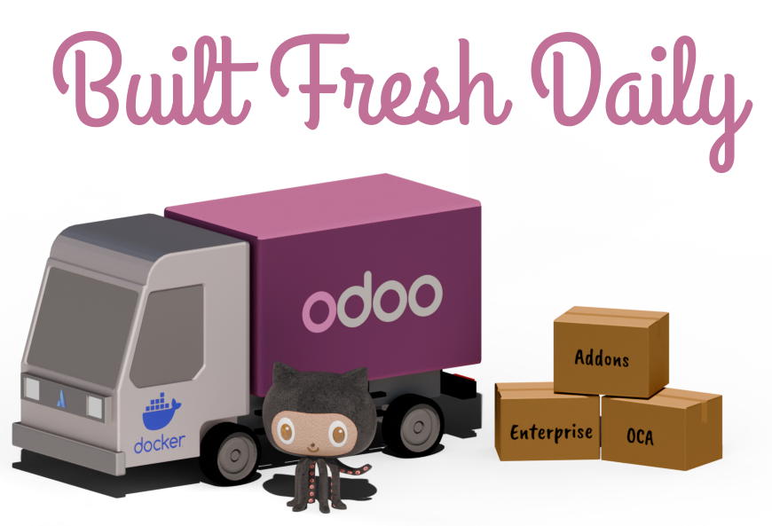

<p align="center">
    
</p>


# Adomi-io - Odoo

Adomi is an Odoo partner and consulting company which offers Odoo as part of our development process.
This repository contains Adomi's docker image for Odoo. This is not the official Odoo docker container. 
If you are looking for the official docker container, please go here:

### [odoo/docker](https://github.com/odoo/docker)


# Why a different container?

This is an Odoo Docker container that is made for developers or infrastructure teams who are looking
to build and launch Odoo containers with cloud providers, companies who want a reliable and open build process, 
or startups looking to offer Odoo as part of a SaaS or IaaS product.

Odoo configuration is generated through `envsubst` and environment variables, making it
simple to customize your setup without modifying your base image, automate deployments and build process, 
and scale your Odoo instances effortlessly.

This repository supports [super simple deployments of Odoo enterprise](#extending-this-image-with-odoo-enterprise), 
[powerful extension options](#extending-this-image), [a multi-stage well-documented build process](./src/Dockerfile),
an [open automated build process via GitHub Actions](./.github/workflows/docker-publish.yml), and 
[robust and open unit testing](./tests/unit-tests.sh). 

This repository is built the latest code from the official [Odoo GitHub repository](https://github.com/odoo/odoo) and is built nightly,
ensuring you always run the most up-to-date version for your specific Odoo release.

## Features

- 🔧 **Flexible Configuration:** Customize your Odoo instance with environment variables and secret files, no rebuilds needed.
- 🚀 **Cloud Native:** Configure your Odoo containers from Amazon ECS, Kubernetes, Digital Ocean, or other cloud providers easily.
- 🏗️ **Multi-Tenant Ready:** Built for SaaS and IaaS companies looking to support multiple Odoo tenants. Support any Odoo configuration option easily.
- 🤝 **Community Driven:** Built and maintained by the community, ensuring continuous improvements and real-world usability.


## Table of Contents

- [Getting Started](#getting-started) 
- [Run This Container](#run-this-container)
  - [Docker](#docker)
  - [Docker Compose](#docker-compose)

## Getting started

Pull the latest nightly build for your version of Odoo (e.g., 18.0):

```bash
docker pull ghcr.io/adomi-io/odoo:18.0
```

#### Supported versions


| Odoo                                               | Pull Command                                 |
|----------------------------------------------------|----------------------------------------------|
| [18.0](https://github.com/adomi-io/odoo/tree/18.0) | ```docker pull ghcr.io/adomi-io/odoo:18.0``` |
| [17.0](https://github.com/adomi-io/odoo/tree/17.0) | ```docker pull ghcr.io/adomi-io/odoo:17.0``` |
| [16.0](https://github.com/adomi-io/odoo/tree/16.0) | ```docker pull ghcr.io/adomi-io/odoo:16.0``` |

## Run this container

### Docker

#### Start a `Postgres` container

```bash
docker run -d \
  --name odoo_db \
  -e POSTGRES_USER=odoo \
  -e POSTGRES_PASSWORD=odoo \
  -e POSTGRES_DB=postgres \
  -p 5432:5432 \
  postgres:13
```
#### Start an `Odoo` container
```bash
docker run --name odoo \
  -p 8069:8069 \
  -e ODOO_DB_HOST=odoo_db \
  -e ODOO_DB_PORT=5432 \
  -e ODOO_DB_USER=odoo \
  -e ODOO_DB_PASSWORD=odoo \
  ghcr.io/adomi-io/odoo:18.0
```

### Docker Compose

This Docker Compose file will launch a copy of Odoo along with a Postgres database.

```yaml
version: '3.8'

services:
  odoo:
    image: ghcr.io/adomi-io/odoo:18.0
    ports:
      - "8069:8069"
    environment:
      # Configure your instances
      ODOO_DB_HOST: ${DB_HOST:-db}
      ODOO_DB_PORT: ${DB_PORT:-5432}
      ODOO_DB_USER: ${DB_USER:-odoo}
      ODOO_DB_PASSWORD: ${DB_PASSWORD:-odoo}
    volumes:
      # Mount your addons
      - ./addons:/volumes/addons
      
      # Persist Odoo Data
      - odoo_data:/volumes/data
      
      # Mount a custom config
      # - ./src/odoo.conf:/volumes/config/odoo.conf
      
      # Add enterprise
      # - ./enterprise:/volumes/enterprise
    depends_on:
      - db
  db:
    image: postgres:13
    container_name: odoo_db
    environment:
      POSTGRES_USER: ${POSTGRES_USER:-odoo}
      POSTGRES_PASSWORD: ${POSTGRES_PASSWORD:-test}
      POSTGRES_DB: ${POSTGRES_DATABASE:-postgres}
    volumes:
      - pg_data:/var/lib/postgresql/data
    ports:
      - "5432:5432"
volumes:
  odoo_data:
  pg_data:
```

Start your containers by running
```shell
docker compose up
```

If you want to always have Odoo running, you can add the following to your docker-compose.yml:

```yml
version: '3.8'

services:
  odoo:
    image: ghcr.io/adomi-io/odoo:18.0
    restart: always # or you can use unless-stopped 
    # ...
```

then start the container in daemon mode by adding the `-d` flag

```shell
docker compose up -d
```

#### Logging into your container

It is useful to log into your running containers. This is like ssh. 

If you are using `docker compose` you can log into your running container with:

```shell
docker exec odoo /bin/bash
```

### Using secret files
You can mount secret files into `./run/secrets/`. Create a file which has the name
you'd like to use with the same name as the environment variable you would be setting.

For example, you can set `ODOO_DB_PASSWORD` by creating a file named `ODOO_DB_PASSWORD`, 
which has the content of your password. The file name in the container is not case-sensitive.

You can load any configuration option from a file

#### Docker
Add the `-v` flag to mount the file into the container in the secrets folder

```bash
docker run --name odoo \
  -p 8069:8069 \
  -e ODOO_DB_HOST=odoo_db \
  -v $(pwd)/ODOO_DB_PASSWORD:/run/secrets/ODOO_DB_PASSWORD \
  -e ODOO_DB_PASSWORD=odoo \
  ghcr.io/adomi-io/odoo:18.0
```

#### Docker Compose
Docker compose has native support for secret files. Simply create a file somewhere in your project
with the password, and use it like the following:

```yaml
version: '3.8'

services:
  odoo:
    image: ghcr.io/adomi-io/odoo:18.0
    ports:
      - "8069:8069"
    environment:
      ODOO_DB_HOST: ${DB_HOST:-db}
      ODOO_DB_PORT: ${DB_PORT:-5432}
      ODOO_DB_USER: ${DB_USER:-odoo}
      # We will load this from the secret file
      # ODOO_DB_PASSWORD: ${DB_PASSWORD:-odoo}
    volumes:
      - ./src/odoo.conf:/volumes/config/odoo.conf
      - ./addons:/volumes/addons
      - odoo_data:/volumes/data
    # Add the secret to the container to mount it in the secrets folder
    secrets:
      - odoo_db_password

# Load the secret file with Docker Compose
secrets:
  odoo_db_password:
    file: odoo_db_password.txt
```

# Extending this image

This image is based on Ubuntu. 

Extending this image will allow you to create your own image, set default environment variables, and bake 
your Odoo config, and your addons into the image. Easily create a container pre-made with Odoo Enterprise.

#### Create a custom Dockerfile
Create a new file named `Dockerfile` in the root of your project

```dockerfile
FROM ghcr.io/adomi-io/odoo:18.0

# Copy your config file into the container, if you have one
# COPY odoo.conf /volumes/config/odoo.conf

# Copy your code into the addons folder
COPY . /volumes/addons
```

#### Running your image with Docker Compose
Follow the [Docker Compose](#docker-compose) section.

Replace the `image` tag with `build`, eg:

Replace this:

```dockerfile
version: '3.8'
services:
  odoo:
    image: ghcr.io/adomi-io/odoo:18.0
    # ...
```

With this:

```dockerfile
version: '3.1'
services:
  web:
    build:
      context: .
      dockerfile: Dockerfile
    # ...
```

Then you can run:

```sh
docker compose build && docker compose up
```

#### Note: Python Virtualenv
A virtual environment is setup at `/venv` inside the container which has Odoo and its dependencies already installed.

This version of python is set in the containers path, so that you are able to use python as you normally would.

eg, this will run in the virtualenv inside the container:
```dockerfile
RUN pip install stripe
RUN pip install -r requirements.txt
RUN python myapp.py
```

# Extending this image with Odoo Enterprise

### Odoo Partners
Adding Odoo enterprise is easy. If you are an Odoo Partner, or have access to the GitHub,
you can run `git clone git@github.com:odoo/enterprise.git` in your projects root

Create a `Dockerfile` in your project with the following content:

```dockerfile
FROM ghcr.io/adomi-io/odoo:18.0

# Copy the Enterprise addons into the folder located at /volumes/enterprise
COPY ./enterprise /volumes/enterprise
```

Build and run your container
```
docker compose build && docker compose up
```

### Downloaded Enterprise

If you are not an Odoo partner, but have a valid enterprise license, you can download Enterprise here:

### [Odoo Downloads](https://www.odoo.com/page/download)

You want to download the Enterprise file from the "Sources" row.


- Extract the downloaded file, and navigate to the `/odoo` directory.
- Rename the `addons` folder to `enterprise`
- Copy the `enterprise` folder you just renamed to the top level of your project.

Run the following:

```dockerfile
FROM ghcr.io/adomi-io/odoo:18.0

# Copy the Enterprise addons into the folder located at /volumes/enterprise
COPY ./enterprise /volumes/enterprise
```

* Note: You can of course change the COPY command here to point to wherever your enterprise code is stored. Copying
it to the enterprise folder is optional.


# Configure your Odoo instances
This Docker container uses `envsubst` to generate an `odoo.conf` file based on your environment variables. What this means is you can configure your Odoo configuration at all stages of the image's lifecycle. 
You can build values into your own docker container, set them at run-time via a mounted file, or defer those values to environment variables which you configure in your cloud providers UI.

This documentation will take you through configuring your Odoo instances

## Default Odoo Configuration File
This image includes a default Odoo configuration, which you can override, modify, or hardcode as needed.

The configuration file is located [here](./src/odoo.conf) and is stored in the container at `/volumes/config/odoo.conf`.

Some configuration options, when set, alter Odoo’s default behavior. To maintain flexibility, many supported options are
included in the entrypoint and Dockerfile, but are commented out by default.

To see a complete list of options, check the default configuration file, and simply un-comment the features you would like to support. 
You can mount that `odoo.conf` at runtime, or bake it into the image by extending this image. For details on extending this image,
see the [Extending this image](#extending-this-image) section.

The following options are enabled by default, and can be set via environment variables:
```ini
[options]
# Database related options

# specify the database user name (default: False)
db_user = $ODOO_DB_USER

# specify the database password (default: False)
db_password = $ODOO_DB_PASSWORD

# specify the database host (default: False)
db_host = $ODOO_DB_HOST

# specify the database name (default: False)
db_name = $ODOO_DB_NAME

# specify the database port (default: False)
db_port = $ODOO_DB_PORT

# Common options

# Comma-separated list of server-wide modules. (default: base,web)
server_wide_modules = $ODOO_SERVER_WIDE_MODULES

# Directory where to store Odoo data (default: /var/lib/odoo)
data_dir = $ODOO_DATA_DIR

# specify additional addons paths (separated by commas). (default: None)
addons_path = $ODOO_ADDONS_PATH

# disable loading demo data for modules to be installed (comma-separated, use "all" for all modules). Requires -d and -i. Default is %default (default: False)
without_demo = $ODOO_WITHOUT_DEMO

# HTTP Service Configuration

# Activate reverse proxy WSGI wrappers (headers rewriting). Only enable this when running behind a trusted web proxy! (default: False)
proxy_mode = $ODOO_PROXY_MODE

# Multiprocessing options (POSIX only)

# Specify the number of workers, 0 disable prefork mode. (default: 0)
workers = $ODOO_WORKERS

# Maximum allowed virtual memory per worker (in bytes), when reached the worker will be reset after the current request (default 2048MiB). (default: 2147483648)
limit_memory_soft = $ODOO_LIMIT_MEMORY_SOFT

# Maximum allowed virtual memory per worker (in bytes), when reached, any memory allocation will fail (default 2560MiB). (default: 2684354560)
limit_memory_hard = $ODOO_LIMIT_MEMORY_HARD

# Maximum allowed CPU time per request (default 60). (default: 60)
limit_time_cpu = $ODOO_LIMIT_TIME_CPU

# Maximum allowed Real time per request (default 120). (default: 120)
limit_time_real = $ODOO_LIMIT_TIME_REAL
```

## Configure default options
You can configure the options specified in the [Default Odoo Configuration File](#default-odoo-configuration-file) via environment variables.

#### Docker

simply set the `-e` flag with the name of the config option you'd like to set, prefixed with ODOO_

for example, `workers` becomes `-e ODOO_WORKERS=5`

```shell
docker run --name odoo \
  -p 8069:8069 \
  -e ODOO_DB_HOST=odoo_db \
  -e ODOO_DB_PORT=5432 \
  -e ODOO_DB_USER=odoo \
  -e ODOO_DB_PASSWORD=odoo \
  -e ODOO_WORKERS=5 \
  ghcr.io/adomi-io/odoo:18.0
```

#### Docker Compose
```yml
version: '3.8'
services:
  odoo:
    image: ghcr.io/adomi-io/odoo:18.0
    ports:
      - "8069:8069"
    environment:
      ODOO_DB_HOST: ${ODOO_DB_HOST:-db}
      ODOO_DB_PORT: ${ODOO_DB_PORT:-5432}
      ODOO_DB_USER: ${ODOO_DB_USER:-odoo}
      ODOO_DB_PASSWORD: ${ODOO_DB_PASSWORD:-odoo}
      # Set the name of the option you would like to set by prefixing it with ODOO_ 
      # for example, the workers configuration option is called ODOO_WORKERS
      ODOO_WORKERS: 5
```


## Use your own odoo.conf

#### Step 1: Create an `odoo.conf` file

Create a file in your projects folder called `odoo.conf`. We recommend copying the [default odoo.conf file provided with this image](./src/odoo.conf).

Modify it with the values you want to use. 

For example:
```ini
[options]
# Hard-code a value by entering the config name
db_host = my-hardcoded-database.abc-corp.com
workers = 2

# Defer to the environment variable by using the name of the config prefixed with ODOO_
db_port = $ODOO_DB_PORT
db_user = $ODOO_DB_USER
db_password = $ODOO_DB_PASSWORD
addons_path = $ODOO_ADDONS_PATH
data_dir = $ODOO_DATA_DIR
```

#### Step 2: Mount the Configuration File

#### Docker

Add the `-v $(pwd)/odoo.conf:/volumes/config/odoo.conf` flag to your `docker run` command. Eg:

```
docker run -d \
  --name odoo \
  -p 8069:8069 \
  -v $(pwd)/odoo.conf:/volumes/config/odoo.conf \
  ghcr.io/adomi-io/odoo:18.0
```

#### Docker Compose

To use your custom configuration file, update your docker-compose.yml
to mount it to `/volumes/config/odoo.conf`:

```yaml
version: '3.8'
services:
  odoo:
    image: ghcr.io/adomi-io/odoo:18.0
    # ...
    volumes:
      - ./odoo.conf:/volumes/config/odoo.conf # Add this to your docker compose configuration
```


## Environment variable defaults

The Dockerfile is built with default environment variables. If you do not override
the environment variables when deploying your Odoo container,

Double check the [Dockerfile](./src/Dockerfile) for more information

```dockerfile
ENV ODOO_CONFIG="/volumes/config/_generated.conf" \
    ODOO_ADDONS_PATH="/odoo/addons,/volumes/addons" \
    ODOO_SAVE="False" \
    ODOO_INIT="" \
    ODOO_UPDATE="" \
    ODOO_WITHOUT_DEMO="False" \
    ODOO_IMPORT_PARTIAL="" \
    ODOO_PIDFILE="" \
    ODOO_UPGRADE_PATH="" \
    ODOO_SERVER_WIDE_MODULES="base,web" \
    ODOO_DATA_DIR="/volumes/data" \
    ODOO_HTTP_INTERFACE="" \
    ODOO_HTTP_PORT="8069" \
    ODOO_GEVENT_PORT="8072" \
    ODOO_HTTP_ENABLE="True" \
    ODOO_PROXY_MODE="False" \
    ODOO_X_SENDFILE="False" \
    ODOO_DBFILTER="" \
    ODOO_TEST_FILE="" \
    ODOO_TEST_ENABLE="" \
    ODOO_TEST_TAGS="" \
    ODOO_SCREENCASTS="" \
    ODOO_SCREENSHOTS="/tmp/odoo_tests" \
    ODOO_LOGFILE="" \
    ODOO_SYSLOG="" \
    ODOO_LOG_HANDLER=":INFO" \
    ODOO_LOG_DB="" \
    ODOO_LOG_DB_LEVEL="warning" \
    ODOO_LOG_LEVEL="info" \
    ODOO_EMAIL_FROM="" \
    ODOO_FROM_FILTER="" \
    ODOO_SMTP_SERVER="localhost" \
    ODOO_SMTP_PORT="25" \
    ODOO_SMTP_SSL="" \
    ODOO_SMTP_USER="" \
    ODOO_SMTP_PASSWORD="" \
    ODOO_SMTP_SSL_CERTIFICATE_FILENAME="" \
    ODOO_SMTP_SSL_PRIVATE_KEY_FILENAME="" \
    ODOO_DB_NAME="" \
    ODOO_DB_USER="" \
    ODOO_DB_PASSWORD="" \
    ODOO_PG_PATH="" \
    ODOO_DB_HOST="" \
    ODOO_DB_REPLICA_HOST="" \
    ODOO_DB_PORT="" \
    ODOO_DB_REPLICA_PORT="" \
    ODOO_DB_SSLMODE="prefer" \
    ODOO_DB_MAXCONN="64" \
    ODOO_DB_MAXCONN_GEVENT="" \
    ODOO_DB_TEMPLATE="template0" \
    ODOO_LOAD_LANGUAGE="" \
    ODOO_LANGUAGE="" \
    ODOO_TRANSLATE_OUT="" \
    ODOO_TRANSLATE_IN="" \
    ODOO_OVERWRITE_EXISTING_TRANSLATIONS="" \
    ODOO_TRANSLATE_MODULES="" \
    ODOO_LIST_DB="True" \
    ODOO_DEV_MODE="" \
    ODOO_SHELL_INTERFACE="" \
    ODOO_STOP_AFTER_INIT="False" \
    ODOO_OSV_MEMORY_COUNT_LIMIT="0" \
    ODOO_TRANSIENT_AGE_LIMIT="1.0" \
    ODOO_MAX_CRON_THREADS="2" \
    ODOO_LIMIT_TIME_WORKER_CRON="0" \
    ODOO_UNACCENT="False" \
    ODOO_GEOIP_CITY_DB="/usr/share/GeoIP/GeoLite2-City.mmdb" \
    ODOO_GEOIP_COUNTRY_DB="/usr/share/GeoIP/GeoLite2-Country.mmdb" \
    ODOO_WORKERS="0" \
    ODOO_LIMIT_MEMORY_SOFT="2147483648" \
    ODOO_LIMIT_MEMORY_SOFT_GEVENT="False" \
    ODOO_LIMIT_MEMORY_HARD="2684354560" \
    ODOO_LIMIT_MEMORY_HARD_GEVENT="False" \
    ODOO_LIMIT_TIME_CPU="60" \
    ODOO_LIMIT_TIME_REAL="120" \
    ODOO_LIMIT_TIME_REAL_CRON="-1" \
    ODOO_LIMIT_REQUEST="65536" \
    IMAGE_SECRETS_DIR="/run/secrets" \
    IMAGE_ODOO_ENTERPRISE_LOCATION="/volumes/enterprise"
```

## Building default configuration into the image

You can set the default value for the environment variables at build-time.

Copy the [odoo.conf](./src/odoo.conf). Uncomment or set the configuration options you'd like to support.

Setting the default with `ENV` will set that value if no environment value is passed into the container.

This lets you set a default, and override it from the environment variables or your cloud providers UI at run-time.

```dockerfile
FROM ghcr.io/adomi-io/odoo:18.0

# Copy your config into the image
COPY odoo.conf /volumes/config/odoo.conf

# Set the default value for subsequent images. 
# Specifying ODOO_WORKERS in env will now override this value
# if ODOO_WORKERS does not exist, it will default to 5 
ENV ODOO_WORKERS=5
```

## Setup Hook

When this image starts, it will process all of the environment variables and their defaults,
and generate an `_generated.conf` configuration file.

After all the environment variables have been parsed, and the `_generated.conf` file has been generated,
but before Odoo is started, the entrypoint will invoke a file located at `/hook_setup.sh`.

You can place any arbitrary bash you would like to be executed immediately prior to Odoo starting.

Simply mount your script to `/hook_setup.sh`

* Note: this script will execute even if you are using this container as a command-line utility (eg: `scaffold`).
This script also runs prior to the `wait-for-psql` script, this does not guarantee that the database is reachable.

# Development with this container

You can use this container as a development environment, and debug your code

## Docker Compose

Follow the [Docker Compose](#docker-compose) setup. This will mount your `./addons`
folder into the docker container, so your changes will reflect immediately in Odoo.

Note for some changes to take effect, for example, UI changes, you will need to go to `Apps` and update your app.

You can use the `venv` inside the docker container for debugging and breakpoints inside of PyCharm

-- todo: Publishing the changes so we can work on this with a project in pycharm

## Debugging the generated config

The `odoo.conf` file is ran through `envsubst` and output to `/volumes/config/_generated.conf`.

If you need to see the final results, you can mount to the `/volumes/config` folder.

Move your config file in your project to `./config/odoo.conf`

Mount the `./config` folder this time instead, eg:

```yaml
version: '3.8'
services:
  odoo:
    image: ghcr.io/adomi-io/odoo:18.0
    # ...
    volumes:
      - ./config:/volumes/config # This will mount your config folder into the container
```

When the container starts, you will see a `_generated.conf` file appear in the `config` folder which contains the final
configuration used by Odoo

# Maintaining this repository

## Adding a new version of Odoo
When Odoo launches a new version, they publish the changes on its own branch. 
This repository works by mirroring the Odoo version branch names. 

When a new version of Odoo releases, create a branch in this 
repository with the same name as the Odoo branch you wish to track.

Add the branch name to the [docker-publish.yml](./.github/workflows/docker-publish.yml) 
file under `push` and `pull_request` branches.

The resulting image will automatically be built, unit-tested, 
deployed, and scheduled the branch for nightly builds.

## Testing

### Unit Tests
The testing script is located in [./tests/unit-tests.sh](./tests/unit-tests.sh)

This will create a Postgres database, install all the selected Odoo addons,
and run their corresponding unit tests.

To run these tests, clone the repository:


```sh
git clone git@github.com:adomi-io/odoo.git
```

`cd` into the `tests` folder of the cloned repository

`cd ./odoo/tests`

From the `tests` folder, run the unit test script

```sh
`./tests/unit-tests.sh`
```


### Front end testing & tours

This is not currently finished

# License

For license details, see the [LICENSE](https://github.com/adomi-io/odoo/blob/master/LICENSE) file in the repository.

