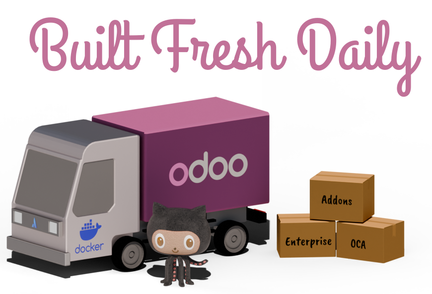
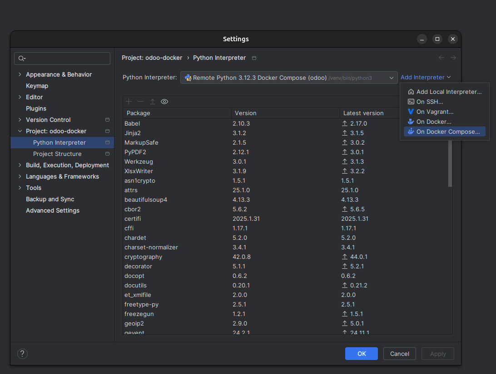
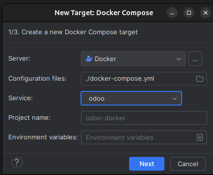
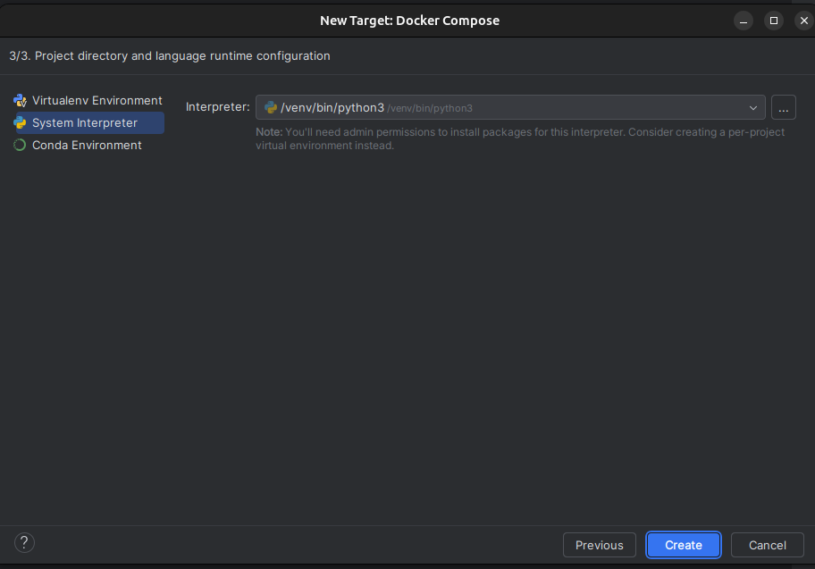
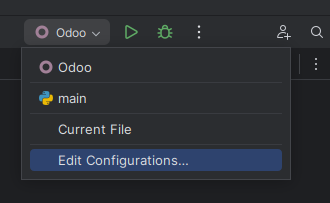
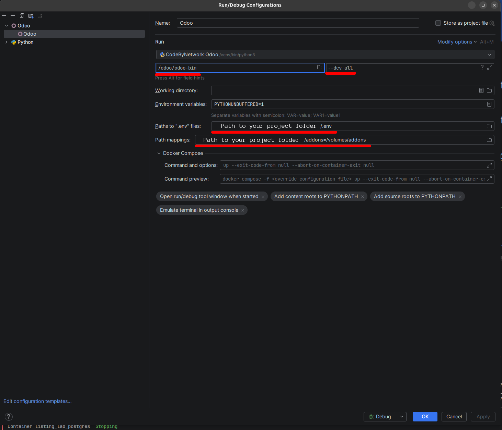

> [!TIP]
> **Want to get started with this image?** 
> 
> We have a boilerplate that lets you get started with just a couple clicks 
> 
> **[Odoo Boilerplate](https://github.com/adomi-io/odoo-boilerplate)**


<p align="center">
    
</p>


# Adomi - Odoo

This is an Odoo docker image which is built nightly from the Odoo community GitHub.

The goal of this repository is to provide a starting point for developers, infrastructure teams, and companies that want to deploy 
Odoo on cloud platforms, build SaaS or IaaS products around it, or use Odoo as the foundation 
for their own custom software.

You can copy this repository and use it as a starting point for your own projects, or build down-stream images which extend
this image.


> [!TIP]
> Upstream source code
> 
> - [odoo/odoo](https://github.com/odoo/odoo)
 
> [!TIP]
> Example downstream images
> 
> - [adomi-io/odoo-boilerplate](https://github.com/adomi-io/odoo-boilerplate) 
> - [adomi-io/odoo-community-base](https://github.com/adomi-io/odoo-community-base)
> - [adomi-io/listing-lab](https://github.com/adomi-io/listing-lab)

# Highlights

This image uses `envsubst` with environment variables to dynamically generate your Odoo configuration on the fly, 
 more closely aligning Odoo with [12factor principals](https://12factor.net/config). 
This lets you customize your deployments without modifying the base image, streamlining your build process, 
and scaling your instances effortlessly.

- 🔧 [**Dynamic Configuration**](#dynamic-configuration): Generate your Odoo configuration on the fly using `envsubst`, giving you flexible, environment-driven deployments without modifying the base image.
- 📦 [**Easy Enterprise Integration**](#extending-this-image-with-odoo-enterprise): Seamlessly extend the base image to support Odoo Enterprise.
- 🛠️ [**Extensible by Design**](#extending-this-image): Clean extension points make it simple to add custom modules or tailor the image for your stack and build downstream images.
- 🧱 [**Multi-Stage Dockerfile**](./src/Dockerfile): A transparent, well-documented build process powered by a multi-stage Dockerfile.
- 🤖 [**Automated CI/CD Pipeline**](./.github/workflows/docker-publish.yml): Fully automated builds via GitHub Actions keep your image consistent and up-to-date.
- 🧪 [**Robust Unit Testing**](./tests/unit-tests.sh): Open, reliable test coverage ensures your Odoo deployments stay stable.
- 🌙 [**Nightly Upstream Sync**](https://github.com/odoo/odoo): Built nightly from the latest code in the official Odoo GitHub repository, so you're always running the freshest version.

# Getting started

> [!WARNING]
> This application is made to run via Docker.
> You can download Docker Desktop if you are on Windows or Mac
>
>**[Download Docker Desktop](https://www.docker.com/products/docker-desktop/)**


Click here to get started, by taking a copy of our [boilerplate repository](https://github.com/adomi-io/odoo-boilerplate):

**[Create a repository from adomi-io/boilerplate-odoo](https://github.com/new?template_name=odoo-boilerplate&template_owner=adomi-io)**

Add your addons to the `addons` folder, and run `docker compose up` to start your Odoo instance.

### Docker
This is a simple example of how to run Odoo with Postgres if you are using Docker directly, without Docker Compose.

#### Start an `Odoo` image
```bash
docker run --name odoo \
  -p 8069:8069 \
  -e ODOO_DB_HOST=your-postgres-host \
  -e ODOO_DB_USER=your-postgres-user \
  -e ODOO_DB_PASSWORD=your-postgres-password \
  -e ODOO_DB_PORT=5432 \
  ghcr.io/adomi-io/odoo:19.0
```

> [!TIP]
> If you need a postgres database, you can run the following command to start a postgres container
> ```bash
> docker run -d \
>  --name odoo_db \
>  -e POSTGRES_USER=odoo \
>  -e POSTGRES_PASSWORD=odoo \
>  -e POSTGRES_DB=postgres \
>  -p 5432:5432 \
>  postgres:13
> ``` 

# Update your image

Pull the latest nightly build for your version of Odoo:

```bash
docker pull ghcr.io/adomi-io/odoo:19.0
```

## Supported versions


| Odoo                                               | Pull Command                                 |
|----------------------------------------------------|----------------------------------------------|
| [19.0](https://github.com/adomi-io/odoo/tree/19.0) | ```docker pull ghcr.io/adomi-io/odoo:19.0``` |

## Using Secret Files

> [!NOTE]
> The file name will be transformed to upper-case in the environment, making odoo_db_password become ODOO_DB_PASSWORD.

Keep your sensitive data secure by mounting secret files into `/run/secrets/`. 

Create a file named after the environment variable you want to set. 

For example, to set `ODOO_DB_PASSWORD`, create a file named `ODOO_DB_PASSWORD` containing your password

This approach lets you securely load any configuration option from a file.

### Docker Compose
Docker Compose supports secret files natively. Create a file (e.g., `odoo_db_password`) and reference it in your `docker-compose.yml`:

```yaml
services:
  odoo:
    image: ghcr.io/adomi-io/odoo:19.0
    ports:
      - "8069:8069"
    environment:
      ODOO_DB_HOST: ${DB_HOST:-db}
      ODOO_DB_PORT: ${DB_PORT:-5432}
      ODOO_DB_USER: ${DB_USER:-odoo}
      # ODOO_DB_PASSWORD will be loaded from the secret file
      # ODOO_DB_PASSWORD: ${DB_PASSWORD:-odoo}
    secrets:
      - odoo_db_password

secrets:
  odoo_db_password:
    file: odoo_db_password.txt
```

### Docker
Mount your secret file with the `-v` flag:

```bash
docker run --name odoo \
  -p 8069:8069 \
  -e ODOO_DB_HOST=odoo_db \
  -v $(pwd)/ODOO_DB_PASSWORD:/run/secrets/ODOO_DB_PASSWORD \
  -e ODOO_DB_PASSWORD=odoo \
  ghcr.io/adomi-io/odoo:19.0
```

# Logging into container

Need to jump into your image like you would via SSH? With Docker Compose, it's as simple as:

```shell
docker compose exec odoo /bin/bash
```

This command drops you right into the image's shell for quick debugging or tweaks.

# Extending This Image

> [!TIP]
> Want to see a project which extends with this image? 
> Check out [our community base image](https://github.com/adomi-io/odoo-community-base) for a complete example

Customize your own image by setting default environment variables,
baking your Odoo config, and adding your custom addons. 
You can even pre-build an image with Odoo Enterprise!

### Create a Custom Dockerfile

In your project's root, create a file named `Dockerfile`:

```dockerfile
FROM ghcr.io/adomi-io/odoo:19.0

# Install Python dependenies
# USER root
# RUN pip install stripe
# RUN pip install -r requirements.txt
# USER ubuntu

# Optionally copy your custom config file
# COPY odoo.conf /volumes/config/odoo.conf

# Copy your custom addons into the image
COPY addons /volumes/addons
```

Instead of using the `image` tag in your `docker-compose.yml`, 
switch to a `build` context. For example, replace:

```yaml
services:
  odoo:
    image: ghcr.io/adomi-io/odoo:19.0
    # ...
```

with:

```yaml
services:
  odoo:
    build:
      context: .
      dockerfile: Dockerfile
    # ...
```

Then build and start your image with:

```sh
docker compose build && docker compose up
```

### Python

A virtual environment is set up at `/venv` inside the image, with Odoo and its dependencies installed. 
This means you can run Python commands as usual:

```dockerfile
RUN pip install stripe
RUN pip install -r requirements.txt
RUN python myapp.py
```

This lets you easily extend and customize the image to fit your development needs. 

# Extending This Image with Odoo Enterprise

## Odoo Partners

If you're an Odoo Partner (or have GitHub access), extending your image is a breeze. 
First, clone the Enterprise repository into your project's root:

```bash
git clone git@github.com:odoo/enterprise.git
```

Then, create a `Dockerfile` in your project with the following content:

```dockerfile
FROM ghcr.io/adomi-io/odoo:19.0

# Copy the Enterprise addons into the folder located at /volumes/enterprise
COPY ./enterprise /volumes/enterprise
```

Finally, build and run your image:

```sh
docker compose up --build
```

## Downloaded Enterprise 

If you're not an Odoo Partner but have a valid Enterprise license, you can download Enterprise from [Odoo Downloads](https://www.odoo.com/page/download).

1. **Download:** Grab the Enterprise file from the "Sources" row.
2. **Extract & Rename:** Extract the file, navigate to the `/odoo` directory, and rename the `addons` folder to `enterprise`.
3. **Copy:** Move the renamed `enterprise` folder to the top level of your project.

Create a `Dockerfile` with the following content:

```dockerfile
FROM ghcr.io/adomi-io/odoo:19.0

# Copy the Enterprise addons into the folder located at /volumes/enterprise
COPY ./enterprise /volumes/enterprise
```

Then, build and run your image:

```sh
docker compose up --build
```

## Extra Addons

This folder is located at `/volumes/extra_addons`.

The extra addons folder is where you can place down-stream addons that you want to build into an image.
This allows you to add addons that are baked into the image (for example, OCA packages), sub-modules, or external addons
and allow the end user to folder-mount their addons into the `/volumes/addons` folder.


```dockerfile
FROM ghcr.io/adomi-io/odoo:19.0

# Copy your submodules and external addons into the folder located at /volumes/extra_addons
COPY ./extra_addons /volumes/extra_addons
```

You can use this to automatically download and build OCA packages and git sub-modules into your image, for example:

```dockerfile
ARG ODOO_IMAGE=ghcr.io/adomi-io/odoo:19.0

# We will use this base image to build OCA packages
FROM alpine:3.20 AS oca_base

RUN apk add --no-cache \
    git

# We will clone our OCA packages into /tmp/oca
WORKDIR /tmp/oca

FROM oca_base AS oca_server_brand

# We will move all the folders we want to use into /tmp/extra_addons
# This lets us selectively copy the folders we want into the image, and just copy one folder
# in the final image
RUN mkdir -p /tmp/extra_addons

# Clone the server-brand addon, and select which folders we want, by copying them
#  into /tmp/extra_addons
RUN git clone \
        --depth 1 \
        --branch 19.0 \
        https://github.com/OCA/server-brand.git \
        /tmp/oca/server-brand \
    && cp -a \
        /tmp/oca/server-brand/disable_odoo_online \
        /tmp/extra_addons/ \
    && cp -a \
        /tmp/oca/server-brand/mail_debranding \
        /tmp/extra_addons/ \
    && cp -a \
        /tmp/oca/server-brand/portal_debranding \
        /tmp/extra_addons/ \
    && cp -a \
        /tmp/oca/server-brand/sale_portal_debranding \
        /tmp/extra_addons/ \
    && cp -a \
        /tmp/oca/server-brand/website_debranding \
        /tmp/extra_addons/

# Build our final local image, which will include the OCA addons
FROM ${ODOO_IMAGE}

# Copy OCA addons into the extra addons folder first
COPY --from=oca_server_brand /tmp/extra_addons/ /volumes/extra_addons/

# Then copy local ./extra_addons into extra_addons in the image, giving our local file system priority
COPY ./extra_addons/ /volumes/extra_addons/
```

> [!TIP]
> Check out our [Community Base Image](https://github.com/adomi-io/odoo-community-base) for an example
> of a downstream image which makes use of the extra_addons folder

# Dynamic Configuration

> [!NOTE]
> This Docker image uses `envsubst` to generate an `odoo.conf` file based on your environment variables. 
> This means you can configure Odoo at every stage of the image's lifecycle. Build values into your image, 
> set them at runtime via a mounted file, or pass them through environment variables in your cloud provider's UI.

> [!TIP]
> You can enable any configuration option to be driven by environment variables by uncommenting it in the [`odoo.conf`](./src/odoo.conf) file.

## Default Odoo Configuration File

This image includes a default Odoo configuration that you can override, modify, or hardcode as needed.

The configuration file is located [here](./src/odoo.conf) and is stored in the image at `/volumes/config/odoo.conf`.

Some options, when set, change Odoo’s default behavior. To keep things flexible, many supported options are included in the entrypoint and Dockerfile but are commented out by default.

To see a complete list of options, review the default configuration file and simply uncomment the features you want to enable. You can mount the `odoo.conf` file at runtime or bake it into the image by extending it (see [Extending this image](#extending-this-image)).

The following options are enabled by default and can be set via environment variables:

```ini
[options]
# specify the database user name (default: False)
db_user = $ODOO_DB_USER

# specify the database password (default: False)
db_password = $ODOO_DB_PASSWORD

# specify the database host (default: False)
db_host = $ODOO_DB_HOST

# specify the database name (default: False)
db_name = $ODOO_DB_NAME

# specify the database port (default: False)
db_port = $ODOO_DB_PORT

# Comma-separated list of server-wide modules. (default: base,web)
server_wide_modules = $ODOO_SERVER_WIDE_MODULES

# Directory where to store Odoo data (default: /var/lib/odoo)
data_dir = $ODOO_DATA_DIR

# specify additional addons paths (separated by commas). (default: None)
addons_path = $ODOO_ADDONS_PATH

# disable loading demo data for modules to be installed (comma-separated, use "all" for all modules). Requires -d and -i. Default is %default (default: False)
without_demo = $ODOO_WITHOUT_DEMO

# Activate reverse proxy WSGI wrappers (headers rewriting). Only enable this when running behind a trusted web proxy! (default: False)
proxy_mode = $ODOO_PROXY_MODE

# Specify the number of workers, 0 disable prefork mode. (default: 0)
workers = $ODOO_WORKERS

# Maximum allowed virtual memory per worker (in bytes), when reached the worker will be reset after the current request (default 2048MiB). (default: 2147483648)
limit_memory_soft = $ODOO_LIMIT_MEMORY_SOFT

# Maximum allowed virtual memory per worker (in bytes), when reached, any memory allocation will fail (default 2560MiB). (default: 2684354560)
limit_memory_hard = $ODOO_LIMIT_MEMORY_HARD

# Maximum allowed CPU time per request (default 60). (default: 60)
limit_time_cpu = $ODOO_LIMIT_TIME_CPU

# Maximum allowed Real time per request (default 120). (default: 120)
limit_time_real = $ODOO_LIMIT_TIME_REAL
```

# Overriding configuration options at runtime

## Docker Compose

You can also set these options in your `docker-compose.yml` file:

```yaml
services:
  odoo:
    image: ghcr.io/adomi-io/odoo:19.0
    ports:
      - "8069:8069"
    environment:
      ODOO_DB_HOST: ${ODOO_DB_HOST:-db}
      ODOO_DB_PORT: ${ODOO_DB_PORT:-5432}
      ODOO_DB_USER: ${ODOO_DB_USER:-odoo}
      ODOO_DB_PASSWORD: ${ODOO_DB_PASSWORD:-odoo}
      # For example, setting the number of workers:
      ODOO_WORKERS: 5
```

## Docker

Simply set the configuration options using the `-e` flag, prefixing the option name with `ODOO_`. For example, to set the number of workers:

```shell
docker run --name odoo \
  -p 8069:8069 \
  -e ODOO_DB_HOST=odoo_db \
  -e ODOO_DB_PORT=5432 \
  -e ODOO_DB_USER=odoo \
  -e ODOO_DB_PASSWORD=odoo \
  -e ODOO_WORKERS=5 \
  ghcr.io/adomi-io/odoo:19.0
```

# Create your own dynamic `odoo.conf`

## Step 1: Create an `odoo.conf` File

Create a file in your project's folder called `odoo.conf`. We typically store these in a folder called `config`

We recommend copying the [default odoo.conf file provided with this image](./src/odoo.conf)
and then modifying it with the values you want to use.

For example:

```ini
[options]
# Hard-code a value by entering the config name
db_host = "my-hardcoded-database.abc-corp.com"
workers = 2

# Defer to the environment variable by using the name of the config prefixed with ODOO_
db_port = $ODOO_DB_PORT
db_user = $ODOO_DB_USER
db_password = $ODOO_DB_PASSWORD
addons_path = $ODOO_ADDONS_PATH
data_dir = $ODOO_DATA_DIR
```

## Step 2: Mount the Configuration File

## Docker Compose

To use your custom configuration file with Docker Compose, update your `docker-compose.yml` to mount it at `/volumes/config/odoo.conf`:

```yaml
services:
  odoo:
    image: ghcr.io/adomi-io/odoo:19.0
    # ...
    volumes:
      # Add this to your docker compose configuration to 
      # mount your configuration file at runtime
      - ./config/odoo.conf:/volumes/config/odoo.conf
```

### Docker

Add the `-v $(pwd)/config/odoo.conf:/volumes/config/odoo.conf` flag to your `docker run` command. For example:

```shell
docker run -d \
  --name odoo \
  -p 8069:8069 \
  -v $(pwd)/config/odoo.conf:/volumes/config/odoo.conf \
  ghcr.io/adomi-io/odoo:19.0
```

## Environment Variable Defaults

The Dockerfile is built with a set of default environment variables. If you do not override these variables when deploying 
your Odoo image, the defaults will be used. For more details, check the [Dockerfile](./src/Dockerfile).

```dockerfile
ENV ODOO_CONFIG="/volumes/config/_generated.conf" \
    ODOO_ADDONS_PATH="/odoo/addons,/volumes/addons" \
    ODOO_GEOIP_CITY_DB="/usr/share/GeoIP/GeoLite2-City.mmdb" \
    ODOO_GEOIP_COUNTRY_DB="/usr/share/GeoIP/GeoLite2-Country.mmdb" \
    SSL_CERT_FILE=/etc/ssl/certs/ca-certificates.crt
```

## Building configuration into the image

You can set the default values for the environment variables at build-time.

Copy the [odoo.conf](./src/odoo.conf) file, then uncomment or set the configuration options you’d like to support.

Setting the default with `ENV` will set that value if no environment variable is passed into the image. This lets you define defaults and override them later via environment variables or your cloud provider's UI at runtime.

```dockerfile
FROM ghcr.io/adomi-io/odoo:19.0

# Copy your config into the image
COPY odoo.conf /volumes/config/odoo.conf

# Set the default value for subsequent images.
# Specifying ODOO_WORKERS in the environment will now override this value;
# if ODOO_WORKERS is not set, it will default to 5.
ENV ODOO_WORKERS=5
```

# Setup Hook
> [!TIP]
> This feature is useful for automatically installing apps when the container first starts
>
> [**See our example hook script**](https://github.com/adomi-io/odoo-community-base/blob/master/hooks/setup/000.setup_adomi_community.sh) from our [**Community base image**](https://github.com/adomi-io/odoo-community-base)

> [!NOTE]
> This script runs even if you’re using the image as a command-line
> utility (e.g., `scaffold`) and executes before the `wait-for-psql`.
> Downstream scripts can call the `wait-for-psql` script if you need to wait for the database to be ready.
> The cli commands are provided to the setup script via its args. 

When the image starts, it processes all the environment variables and their defaults to generate a `_generated.conf` file.

Once that's done, but before Odoo launches, the entrypoint invokes a script located at `/hook_setup`.

By default, `/hook_setup` will look for user-mounted setup hooks under `/hooks/setup` (override with `HOOK_SETUP_DIR`).

Hooks are executed in ascending order based on the leading number in the filename:

```text
<number>.<anything>
0.install_deps.sh
10.configure_odoo
```
Mount your hooks directory to `/hooks/setup` (or set `HOOK_SETUP_DIR` to another path).

# Development with this image

You can use this image as a development environment and debug and test your code. 
This assumes you have the [PyCharm Odoo](https://plugins.jetbrains.com/plugin/13499-odoo) plugin by Trịnh Anh Ngọc. 

**Expand the following section for using this container as a development environment**

<details><summary>Use this image as a development environment w/ Breakpoints</summary>

## Docker Compose

Follow the [Docker Compose](#docker-compose) setup. This will mount your `./addons` folder into the image so that your changes are reflected immediately in Odoo.

You can also use the virtual environment (`venv`) inside the image for debugging and setting breakpoints in PyCharm.

## Adding the venv as an Interpreter in PyCharm

1. Go to **File → Settings → Project → Python Interpreter**.
2. Click **Add Interpreter** and select **On Docker Compose**.

   

3. Choose `odoo` as the service.

   

4. Select the Python interpreter located in the `/venv` folder.

   

5. Click **Create**.


## Adding a Debug Configuration

1. Click the targets and edit the current configurations.

   

2. Click **Add** in the top left and select an **Odoo** run configuration.

   

3. Set the interpreter to the one you just set up. The `odoo-bin` file is located at `/odoo/odoo-bin`.

4. Add the path mapping from `./addons` to `/volumes/addons`.

5. Click **OK**, then click the **Debug** button. You can now set breakpoints and debug your code.
</details>

## Debugging the Generated Config

The `odoo.conf` file is processed through `envsubst` and output to `/volumes/config/_generated.conf`. If you need to inspect the final configuration, mount the `/volumes/config` folder to your host.

For example, move your config file to `./config/odoo.conf` in your project, then update your Docker Compose configuration to mount the `./config` folder:

```yaml
services:
  odoo:
    image: ghcr.io/adomi-io/odoo:19.0
    # ...
    volumes:
      - ./config:/volumes/config # This mounts your config folder into the image
```

When the image starts, a `_generated.conf` file will appear in the `./config` folder, 
showing the final configuration used by Odoo.


# Maintaining This Repository

## Adding a New Version of Odoo

When Odoo launches a new version, they publish the changes on its own branch. This repository mirrors the Odoo version branch names.

When a new version is released, create a branch in this repository with the same name as the Odoo branch you wish to track.

Then, add the branch name to the [docker-publish.yml](./.github/workflows/docker-publish.yml) file under the `strategy/matrix/branch` section.

The resulting image will be automatically built, unit-tested, deployed, and scheduled for nightly builds.

## Testing

### Unit Tests

The testing script is located in [./tests/unit-tests.sh](./tests/unit-tests.sh).

This script will create a Postgres database, install all selected Odoo addons, and run the corresponding unit tests.

To run these tests, clone the repository:

```sh
git clone git@github.com:adomi-io/odoo.git
```

Then, navigate to the `tests` folder:

```sh
cd odoo/tests
```

Finally, run the unit test script:

```sh
./tests/unit-tests.sh
```

# License

For license details, see the [LICENSE](https://github.com/adomi-io/odoo/blob/master/LICENSE) file in the repository.

